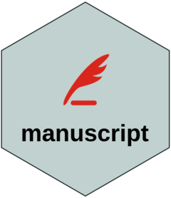

<!-- README.md is generated from README.Rmd. Please edit that file -->

# manuscript 

<!-- badges: start -->

<!-- badges: end -->

The goal of the manuscript tool is to assist in writing scientific
manuscripts. It facilitates the creation of a Quarto project with a
manuscript template and offers additional functions.

## Installation

You can install the development version of manuscript like so:

``` r
install.package("devtools")
devtools::install_github("gigu003/manuscript")
```

## Example

This is a basic example which shows you how to solve a common problem:

``` r
library(manuscript)
## basic example code
```
